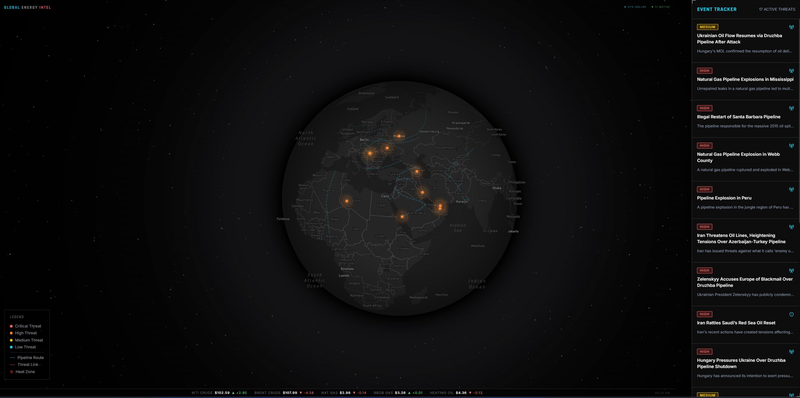

# Global Energy Intel



Global Energy Intel is a high-fidelity, tactical geospatial intelligence platform designed for monitoring global energy infrastructure threats. Built with a minimalist "Palantir Gotham" aesthetic, it ingests real-time news data, processes it via AI to determine geographic coordinates and impact severity, and visualizes the results on an interactive 3D globe.

## 🚀 Live Demo
**Dashboard:** [https://global-energy-intel.vercel.app](https://global-energy-intel.vercel.app)
*(Note: Admin ingest routes require a secure passphrase).*

---

## 🛠️ Features

- **Tactical Minimalist UI:** Ghosted-text HUD styling, CRT scanlines, and high-contrast threat indicators.
- **Automated Intelligence Ingestion:** Connects directly into global news RSS feeds and filters for energy, geopolitical, and weather events.
- **AI Spatial Classification (GPT-4o-mini):** Automatically reads unstructured text and extracts latitude/longitude coordinates, directional market impact (bullish/bearish), affected asset classes, and assigns a confidence protocol score.
- **Geospatial Visualization (Mapbox GL):** 
  - Dynamic 3D globe projection.
  - Custom SVG radar ping animations for active threat vectors.
  - Interactive major global pipeline network overlays.
  - "Smart Threat Link" proximity visualizer (automatically draws connecting lines between localized, related events).
- **Server-Side Security:** Built on Next.js App Router (Server Actions) to ensure that API keys (OpenAI, Supabase) never reach the client's browser.
- **Live Oil/Gas Ticker:** Real-time market data directly embedded in the HUD.

---

## 🏗️ Architecture Stack

- **Framework:** [Next.js 15](https://nextjs.org/) (App Router, Server Actions, TypeScript)
- **Database:** [Supabase](https://supabase.com/) (PostgreSQL with PostGIS for spatial clustering and point handling)
- **Map Rendering:** [Mapbox GL JS](https://www.mapbox.com/)
- **AI Engine:** [OpenAI API](https://openai.com/api/) (`gpt-4o-mini` with structured JSON output response formatting)
- **Deployment:** [Vercel](https://vercel.com/)

---

## 🔒 Security Posture

This repository follows strict security protocols appropriate for public intelligence dashboards:
- Rate limitation and authentication gates applied to all AI-consuming and database-writing endpoints. 
- Row Level Security (RLS) restricts public access to read-only views on the database.
- Complete separation of public tokens from sensitive backend infrastructure keys.
- Robust deduplication algorithms prevent database bloat and AI-ingestion spam.

--- 

## 💻 Local Development

1. **Clone the repository**
   ```bash
   git clone https://github.com/yourusername/global-energy-intel.git
   cd global-energy-intel
   ```

2. **Install Dependencies**
   ```bash
   npm install
   ```

3. **Environment Setup**
    Create a `.env.local` file and add the required parameters:
   ```env
   NEXT_PUBLIC_MAPBOX_TOKEN=your_public_token
   NEXT_PUBLIC_SUPABASE_URL=your_db_url
   NEXT_PUBLIC_SUPABASE_ANON_KEY=your_anon_key
   OPENAI_API_KEY=your_openai_secret
   SUPABASE_SERVICE_ROLE_KEY=your_supabase_secret
   ADMIN_SECRET=your_ingest_password
   ```

4. **Launch the Node**
   ```bash
   npm run dev
   ```
